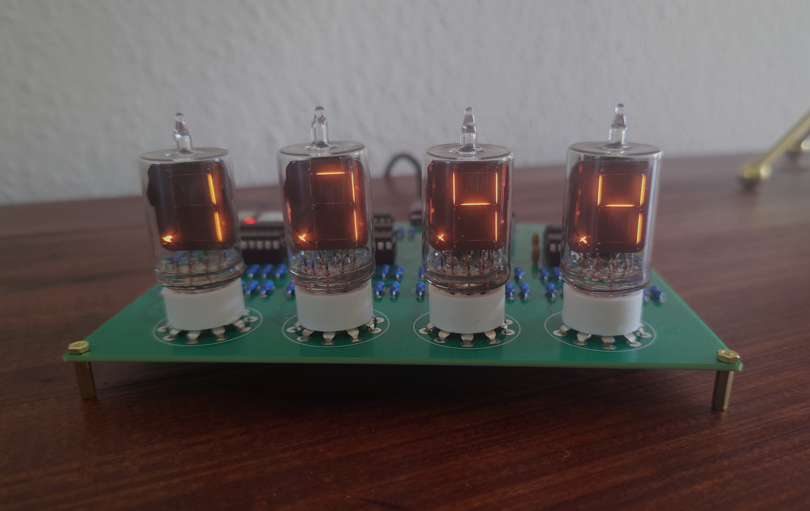
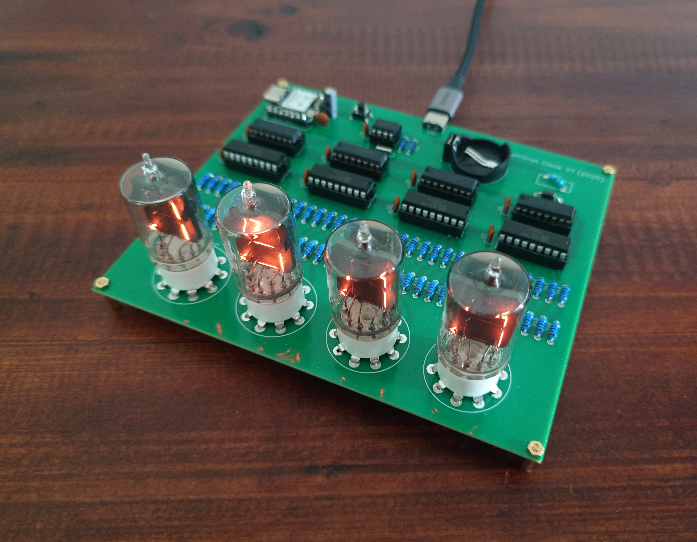
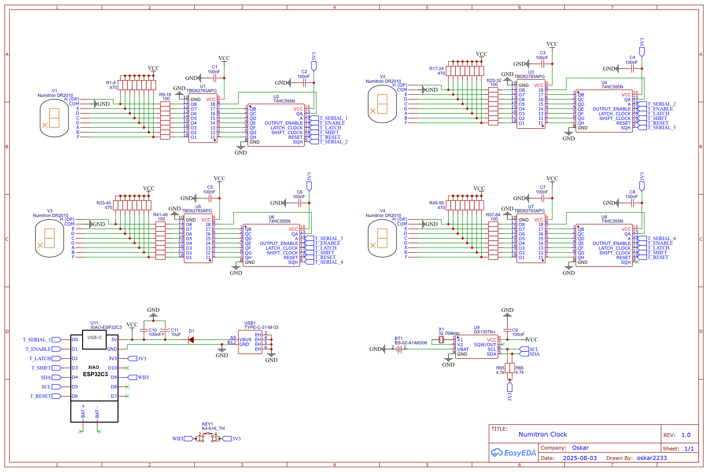
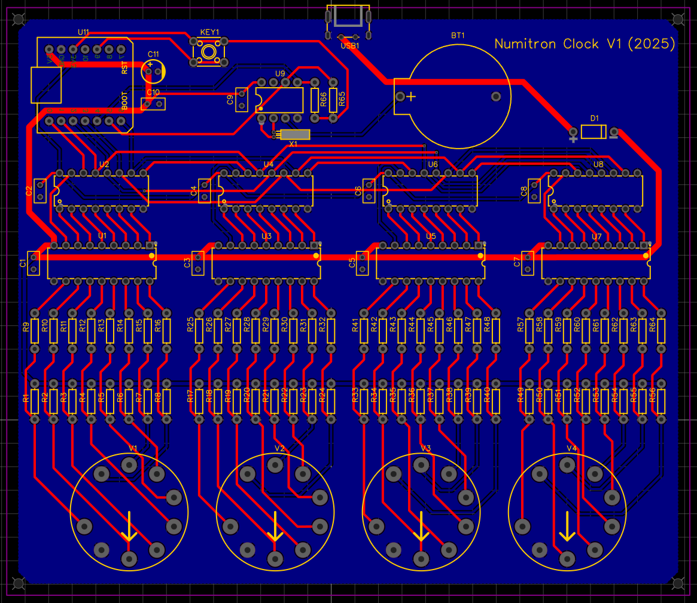

# Numitron Clock

This is the repository for my Numitron clock project. It contains the software for the microcontroller as well as the Gerber and BOM files.

## Pictures

<table>
    <tr>
        <td></td>
        <td></td>
    </tr>
    <tr>
        <td></td>
        <td></td>
    </tr>
</table>

## Compatible Numitron Tubes

This clock is designed for DR2010 Numitrons by RCA, which include a decimal point. However, it also works with DR2000 Numitrons, which are identical except for the missing decimal point. When using the DR2000 version, the only difference is the absence of the blinking decimal points that indicate the seconds. Note that the same Numitrons were also sold by other manufacturers who sometimes used different prefixes such as DA instead of DR. These tubes are fully compatible and can be used as well.

## Manufacturing

The Gerber and BOM files are located in the root directory of this repository. The PCBs for this project were generously sponsored by [PCBWay](https://www.pcbway.com/), who provided excellent results and offer a very user-friendly website. That said, the Gerber files are also compatible with most other PCB manufacturers, including [JLCPCB](https://jlcpcb.com/).

## BOM

The BOM (Bill of Materials) file lists all the components needed to assemble this clock. Additionally, you will need four 9-pin Noval sockets for PCB mounting, which are inexpensive and readily available on platforms like AliExpress. I recommend choosing the plastic versions over ceramic ones, as the ceramic sockets tend to be a very tight fit and could risk damaging the tube's seals.

`BOM_LCSC.xls` additionally includes links to the exact components I used.

## Configuring the Software

Currently, the clock's software is still fairly limited, and all configuration options have to be set at compile time.

### Configuring Wi-Fi

The clock periodically synchronizes its time with a configured NTP server, which requires a wireless internet connection. To set up Wi-Fi, rename the file `_secrets.h` to `secrets.h` and provide the credentials for your access point by adjusting `WIFI_SSID` and `WIFI_PASSWORD`.

### Configuring the NTP Server

You can configure the NTP server by modifying two defines in `numitron_clock.ino`. The first, `NTP_SERVER`, can be left at its default value or changed to any other NTP server you prefer. The second, `TIMEZONE`, requires a string in the format recognized by an NTP server. A list of valid timezone strings can be found [here](https://ftp.fau.de/aminet/util/time/tzinfo.txt)